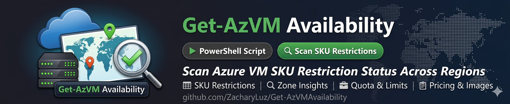

<p align="center">
  
</p>

A PowerShell tool for scanning Azure VM SKU restriction status, quota, pricing, and placement signals across regions.


## Overview

Get-AzVMAvailability scans Azure regions for VM SKU restriction status, quota headroom, zone support, pricing, placement signals, and image compatibility. It helps you identify where ARM returns no blocking restrictions for your subscription so you can plan deployments accordingly.

## Important Framing

The status labels come from the ARM `Microsoft.Compute/skus` API restriction metadata. `OK` means Azure did not return a blocking SKU restriction record for the scanned subscription, region, SKU, or zone. It does not prove live physical capacity, and deployment can still fail because of quota, allocation, policy, networking dependencies, or transient platform conditions.

Use `-ShowPlacement`, capacity reservations/probes, or an actual deployment validation when you need stronger allocation confidence.

### What This Tool Proves vs What It Does NOT

| Signal | What It Tells You | What It Does NOT Tell You |
|--------|-------------------|--------------------------|
| **Restriction Status** (OK/LIMITED/etc.) | ARM returned no blocking SKU restriction for your subscription/region/zone | Whether Azure has physical hardware available right now |
| **Quota Headroom** | How many vCPUs remain in your subscription quota | Whether those vCPUs can be allocated (quota ≠ capacity) |
| **Zone Support** | Which availability zones the SKU is offered in | Whether those zones have allocatable capacity |
| **Placement Score** | Spot VM allocation likelihood (High/Medium/Low) | Standard VM allocation likelihood |
| **Pricing** | Retail or negotiated price per hour | Nothing about capacity |
| **Image Compatibility** | Whether your image URN is compatible with the SKU | Nothing about capacity |

> **The only ways to confirm actual capacity:** a successful deployment, a Capacity Reservation, or an internal Azure capacity signal.

## What's New

### v3.0.0
- Breaking: Capacity field renamed to RestrictionStatus, CAPACITY-CONSTRAINED status renamed to ZONE-LIMITED, schemaVersion bumped to 2.0. All user-facing text clarified to reference ARM restriction metadata instead of capacity.

### v2.3.1
- Metadata-only: updated README What's New section and CHANGELOG release notes for PSGallery parity

### v2.3.0
- **`-ArchFilter` parameter** — filter scan results to specific CPU architectures (x64, ARM64)
- **ValidateSet cleanup** — removed redundant `Arm64` from `-ArchFilter` ValidateSet (PowerShell is case-insensitive)
- **Serial scan path** — inlined `CpuArchitectureType` extraction to match parallel block pattern; unknown-arch SKUs now excluded (was defaulting to x64)
- **CHANGELOG placement** — moved ArchFilter entry from premature `[2.3.0]` to `[Unreleased]` (corrected in this release)
- **ROADMAP v2.2.2 blockquote accuracy (Copilot reviews on PR #154 and PR #156)** — corrected the description of `release-publish.yml`'s lint gate. Initial fix removed the inaccurate "reports PSScriptAnalyzer warnings via SARIF and only blocks on errors" wording (workflow has no SARIF emitter or `security-events: write` permission). Follow-up Copilot review on PR #156 (ID 3211981166) flagged the replacement "Error/Warning severity" wording as still inaccurate; final wording now reads "PSScriptAnalyzer with `-Severity Error` (only Error-severity findings block; uses shared `PSScriptAnalyzerSettings.psd1`)" — verified against `.github/workflows/release-publish.yml:47-48`.
- **`artifacts/copilot-review-log.md` append-only compliance (Copilot reviews on PR #154 and PR #156)** — initial PR #156 commit swapped the PR #155 and PR #154 (post-bump) sections to honor a Copilot suggestion (ID 3209405138) about chronological ordering. Follow-up Copilot review (ID 3211981185) flagged that swap as a violation of the documented "never overwrite — always append" rule. Final state: section order reverted to the original on-disk (append-arrival) order; new entries continue to land at strict EOF; placeholder `Reviewed head SHA: pending` replaced with actual commit SHA per Copilot ID 3211981197.

### v2.2.2
- **PSGallery package parity** - release publishing now stages the runtime UpgradePath data, README, LICENSE, CHANGELOG, examples, and curated docs into the module package before publishing. A package-layout Pester test now guards those assets so PSGallery installs keep parity with repo-based usage.
- **Version bump workflow coverage** — `version-bump.yml` now updates the README badge, demo guide, ROADMAP current-release header, and psd1 `ReleaseNotes` alongside the existing wrapper, manifest, public help, and changelog updates. Current public help and demo-guide version stamps were also realigned to v2.2.1.
- **Release publish gate** — `release-publish.yml` now logs non-blocking PSScriptAnalyzer diagnostics but filters failures to blocking errors before stopping PSGallery publishing, matching the main lint gate behavior that already reports warnings through SARIF/code scanning.

### v2.2.1
- **Tier 2 (Cost Management) was not actually region-scoped.** The fallback query filtered only `MeterCategory = 'Virtual Machines'` and grouped by `MeterSubcategory` + `Meter`, then wrote every returned usage-derived rate under the requested `$armLocation`. In a subscription with multi-region VM usage, another region's effective rate could be cached as the queried region's negotiated PAYG. The query now also groups by `ResourceLocation`, and rows whose normalized location does not equal `$armLocation` are rejected before being written to the cache. A small `Tier 2 skip reasons` verbose line surfaces the new counters.
- **Tier 2 silently laundered Spot / Low Priority rows into the negotiated PAYG map.** The previous code stripped a trailing ` Spot` / ` Low Priority` from the meter name with a regex, so a spot rate (~⅛ of PAYG) could be cached as a negotiated PAYG rate. Spot/Low-Priority rows are now skipped outright in Tier 2, matching the Tier 1 behaviour fixed in v2.2.0.
- **Negotiated Savings Plan maps fell back to retail in commercial regions.** The Price Sheet API publishes SP rows under `meterLocation` keys (`useast2`, `euwest`, `apsoutheast`), but the ARM→cache alias pass that the Regular PAYG map enjoys was never run on the SP1Yr / SP3Yr maps. Commercial regions like `eastus2` therefore missed every negotiated SP probe and silently inherited retail SP rates. A shared `applyArmAliases` helper now applies the same alias resolution to the Regular map and both Savings Plan term maps, in both the live-scan path and the disk-cache load path. Existing v4 disk caches are fixed up on load — no cache version bump or one-time refetch required.
- **`tools/Update-RetirementData.ps1`** no longer stamps `Last verified: <today>` when newly detected series still need manual regex patterns added. With pending entries, the script now emits a warning, leaves the timestamp untouched, and exits non-zero so CI/operators can act on the gap before the static table is marked fresh.
- **`-LifecycleRecommendations <path>` legacy positional form preserved.** When `-LifecycleRecommendations` was reshaped from `[string]` to `[switch]` (with the path moving to `-LifecycleFile`), existing callers using the old positional form `-LifecycleRecommendations .\my-vms.csv` would error out. `-LifecycleFile` is now `Position = 0`, so the legacy invocation rebinds the path to `-LifecycleFile` and continues to work.
- **`Get-SkuRetirementInfo.ps1`: Av1 (`Retired`) entry moved into the retired block** so the table sections match their statuses (was sitting under "Scheduled for retirement").
- **`-AZ` HelpMessage** in the wrapper now matches the actual lifecycle output (`Zones (Deployed)` + `Zones (Supported)`); previously claimed a single `Zones (Available)` column.

> Full history: [CHANGELOG.md](CHANGELOG.md)

## Features

- **Multi-Region Parallel Scanning** - Scan 10+ regions in ~15 seconds using concurrent HttpClient-based REST calls
- **SKU Filtering** - Filter to specific SKUs with wildcard support (e.g., `Standard_D*_v5`)
- **Lifecycle Recommendations** - Run fully autonomous with `-LifecycleRecommendations` — no prompts, auto-enables pricing, Excel export, savings plan/reservation details, and quota. Without `-LifecycleFile`, pulls live VM inventory from Azure via Resource Graph. With `-LifecycleFile`, loads VMs from a CSV/JSON/XLSX file. Legacy positional form `-LifecycleRecommendations .\my-vms.csv` is also supported
- **Live Lifecycle Scan** - `-LifecycleScan` pulls VM inventory directly from Azure via Resource Graph with management group, resource group, and tag filters
- **Deployment Mapping** - `-SubMap` / `-RGMap` sheets group affected VMs by subscription or resource group with risk enrichment
- **Pricing Information** - Show hourly/monthly pricing (retail or negotiated EA/MCA rates) with optional Savings Plan and Reserved Instance comparisons
- **Spot VM Pricing** - Include Spot pricing alongside on-demand rates
- **Placement Scores** - Show allocation likelihood (High/Medium/Low) for each SKU via Azure Spot Placement API
- **Image Compatibility** - Verify Gen1/Gen2 and x64/ARM64 requirements
- **Zone Availability** - Per-zone availability details
- **Quota Tracking** - Available vCPU quota per family
- **Multi-Region Matrix** - Color-coded comparison of returned ARM SKU restriction status
- **Interactive Drill-Down** - Explore specific families and SKUs
- **Export Options** - CSV and styled XLSX with conditional formatting
- **JSON Output** - Structured JSON for AI agent integration and automation pipelines
- **Inventory Readiness** - Validate returned SKU restriction status and quota for an entire VM BOM in one command
- **Compatibility-Validated Recommendations** - Alternatives are validated to meet or exceed the target SKU's NICs, accelerated networking, premium IO, disk interface, ephemeral OS disk, and Ultra SSD requirements. Data disks and IOPS are scored as soft dimensions

## Quick Comparison

| Task                           | Azure Portal            | This Script          |
| ------------------------------ | ----------------------- | -------------------- |
| Check 10 regions               | ~5 minutes              | ~15 seconds          |
| Get quota + restriction signal | Multiple blades         | Single view          |
| Compare pricing across regions | Separate calculator     | Integrated           |
| Filter to specific SKUs        | Scroll through hundreds | Wildcard filtering   |
| Check image compatibility      | Manual research         | Automated validation |
| Analyze VM retirement risk     | Azure Advisor + manual  | Single command       |
| Export results                 | Manual copy/paste       | One command          |

## Use Cases

- **VM Lifecycle & Retirement Planning** - Identify old-gen and retiring SKUs across your fleet and get validated upgrade paths
- **Disaster Recovery Planning** - Identify backup regions with no returned SKU restrictions
- **Multi-Region Deployments** - Find regions where required SKUs are offered and unrestricted by ARM metadata
- **GPU/HPC Workloads** - NC, ND, NV series are often constrained; find where ARM returns them without blocking restrictions
- **Inventory Readiness Validation** - Verify SKU restriction status and quota for an entire VM BOM before deployment
- **Image Compatibility** - Verify SKUs support your Gen2 or ARM64 images before deployment
- **Troubleshooting Deployments** - Quickly identify why a deployment might be failing

## Requirements

- **PowerShell 7.0+** (required)
- **Azure PowerShell Modules**: `Az.Accounts`, `Az.Compute`, `Az.Resources`
- **Optional**: `ImportExcel` module for styled XLSX export
- **Optional**: `Az.ResourceGraph` module for `-LifecycleRecommendations` and `-LifecycleScan` live VM inventory

## Quick Start

### Option A: Module (recommended)

```powershell
# Install from PSGallery (available after v2.0.0 release)
Install-Module AzVMAvailability -Repository PSGallery

# Or import directly from the repo
Import-Module .\AzVMAvailability

# Login and scan
Connect-AzAccount
Get-AzVMAvailability -Region "eastus" -NoPrompt
```

### Option B: Script (unchanged)

```powershell
# Interactive Login to Azure
Connect-AzAccount -Tenant YourTenantIdHere -subscription YourSubIdHere

# Interactive mode - prompts for all options
.\Get-AzVMAvailability.ps1

# Automated mode - uses current subscription
.\Get-AzVMAvailability.ps1 -NoPrompt -Region "eastus","westus2"

# With auto-export
.\Get-AzVMAvailability.ps1 -Region "eastus","eastus2" -AutoExport

# Inventory readiness check from CSV file
.\Get-AzVMAvailability.ps1 -InventoryFile .\examples\fleet-bom.csv -Region "eastus" -NoPrompt

# Lifecycle scan — pull live VM inventory from Azure and analyze retirement risk
# Runs fully autonomous: no prompts, auto-enables pricing, Excel export, and quota
.\Get-AzVMAvailability.ps1 -LifecycleRecommendations

# Lifecycle analysis — load VMs from a CSV/JSON/XLSX file instead of live scan
.\Get-AzVMAvailability.ps1 -LifecycleRecommendations -LifecycleFile .\my-vms.csv -Region "eastus"

# Lifecycle analysis — from Azure portal VM export (XLSX)
.\Get-AzVMAvailability.ps1 -LifecycleRecommendations -LifecycleFile .\AzureVirtualMachines.xlsx

# Live lifecycle scan with filters — management group, resource group, or tag scoping
.\Get-AzVMAvailability.ps1 -LifecycleScan -ManagementGroup "Corp" -Tag @{Environment='prod'} -NoPrompt
```

## Script vs Module

As of v2.0.0, Get-AzVMAvailability is available as both a standalone script and a PowerShell module. **Existing script users see no changes** — the `.ps1` file still works exactly as before.

| | Script (`.\Get-AzVMAvailability.ps1`) | Module (`Get-AzVMAvailability`) |
|---|---|---|
| **Install** | `git clone` or download ZIP | `Install-Module AzVMAvailability` |
| **Run** | `.\Get-AzVMAvailability.ps1 -Region eastus` | `Get-AzVMAvailability -Region eastus` |
| **Works from any directory** | No — requires full path or `cd` to repo | Yes — available globally after install |
| **Update** | `git pull` | `Update-Module AzVMAvailability` |
| **Tab completion & Get-Help** | Requires dot-sourcing first | Works immediately |
| **Use in automation scripts** | `. .\Get-AzVMAvailability.ps1` (dot-source) | `Import-Module AzVMAvailability` |
| **Parameters & output** | Identical | Identical |

### Staying Up to Date

- **Module users**: Run `Update-Module AzVMAvailability` periodically, or check your installed version with `Get-Module AzVMAvailability -ListAvailable`.
- **Script users**: Run `git pull` to get the latest version.
- **Release notifications**: Click **Watch** → **Custom** → **Releases** on the [GitHub repo](https://github.com/ZacharyLuz/Get-AzVMAvailability) to be notified of new versions.

## Documentation

| Topic | Description |
|-------|-------------|
| [Parameters](docs/parameters.md) | Reference table for all parameters, including names, types, and descriptions |
| [Usage Examples](docs/usage-examples.md) | Common scanning patterns — GPU, pricing, export, multi-region |
| [Inventory Planning](docs/inventory-planning.md) | Validate restriction status and quota for an entire VM BOM |
| [Lifecycle Recommendations](docs/lifecycle-recommendations.md) | Retirement risk analysis with upgrade alternatives |
| [Region Presets](docs/region-presets.md) | Pre-built region sets for US, Europe, Asia-Pacific, sovereign clouds |
| [Image Compatibility](docs/image-compatibility.md) | Gen1/Gen2 and x64/ARM64 image checking |
| [Output & Pricing](docs/output-and-pricing.md) | Console output, pricing auto-detection, Excel export, status legend |
| [Cloud Environments](docs/cloud-environments.md) | Supported Azure clouds (Commercial, Government, China) |
| [AI Agent Integration](docs/agent-integration.md) | Copilot skill for natural-language VM restriction/quota queries |
| [GitHub Codespaces](docs/codespaces.md) | Run in a browser with zero local setup |
| [Local Installation](docs/local-installation.md) | Clone, install modules, and import |

## Contributing

Contributions are welcome! Please see [CONTRIBUTING.md](CONTRIBUTING.md) for guidelines.

## Roadmap

See [ROADMAP.md](ROADMAP.md) for planned features. Recently shipped:
- **Azure Resource Graph integration** — live VM inventory via `-LifecycleScan` (v1.14.0)
- **PowerShell module** — `Install-Module AzVMAvailability` from PSGallery (v2.0.0)

Up next:
- HTML reports and trend tracking

## License

This project is licensed under the MIT License - see [LICENSE](LICENSE) for details.

## Author

**Zachary Luz** — Personal project (not an official Microsoft product)

## Support & Responsible Use

This tool queries only **public Azure APIs** (SKU availability, quota, retail pricing) against your own Azure subscriptions. It reads subscription metadata (such as subscription IDs/names, regions, quotas, and usage) and writes results locally (console output and CSV/XLSX exports); it does **not** transmit this data off your machine except as required to call Azure APIs.

- **Issues & PRs**: Welcome! Please do not include subscription IDs, tenant IDs, internal URLs, or any confidential information.
- **Azure support**: For Azure platform issues or outages, contact [Azure Support](https://azure.microsoft.com/support/) — not this repository.
- **Exported files**: Review CSV/XLSX exports before sharing externally — they may contain subscription IDs, region information, quotas, and usage details for your environment.

## Disclosure & Disclaimer

The author is a Microsoft employee; however, this is a **personal open-source project**. It is **not** an official Microsoft product, nor is it endorsed, sponsored, or supported by Microsoft.

- **No warranty**: Provided "as-is" under the [MIT License](LICENSE).
- **No official support**: For Azure platform issues, use [Azure Support](https://azure.microsoft.com/support/).
- **No confidential information**: This tool uses only publicly documented Azure APIs. Please do not share internal or confidential information in issues, pull requests, or discussions.
- **Trademarks**: "Microsoft" and "Azure" are trademarks of Microsoft Corporation. Their use here is for identification only and does not imply endorsement.

## Changelog

See [CHANGELOG.md](CHANGELOG.md) for version history.

## Troubleshooting

### Security warning when running downloaded script

If Windows warns that the script came from the internet, unblock it once:

```powershell
Unblock-File .\Get-AzVMAvailability.ps1
```

### `AzureEndpoints` property error at startup

If you see an error like `The property 'AzureEndpoints' cannot be found on this object`, you are likely running an older script copy.

```powershell
Select-String -Path .\Get-AzVMAvailability.ps1 -Pattern 'AzureEndpoints\s*=\s*\$null'
```

If this command returns a match, the file you are running still contains the old code path and should be replaced with the current `Get-AzVMAvailability.ps1` wrapper from this repo, or you should run the module directly with `Import-Module .\AzVMAvailability`.

If the command returns no output, that stale-copy marker is not present in this file. Confirm you are launching the expected script path and not another older copy from a different folder.

